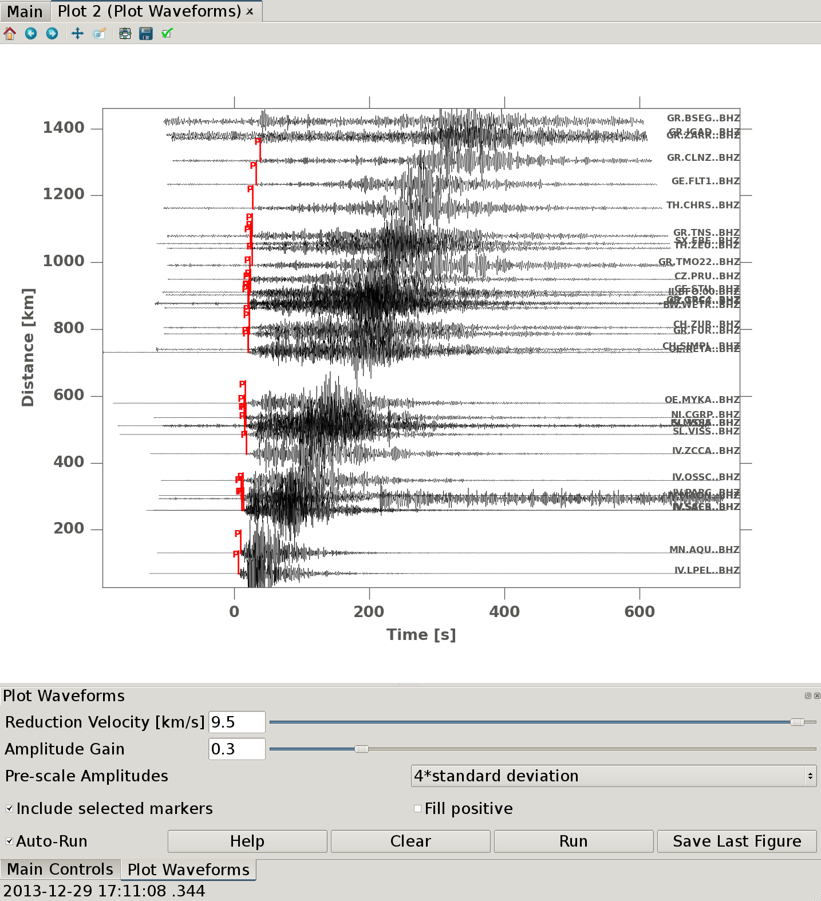
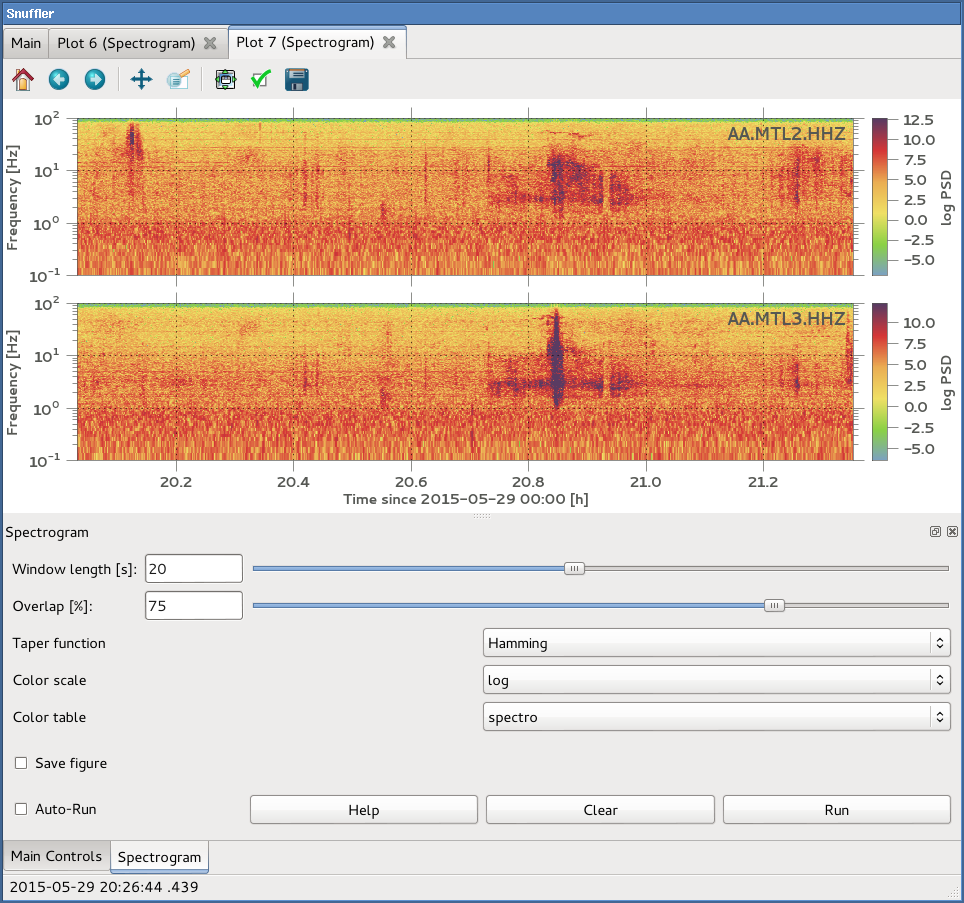
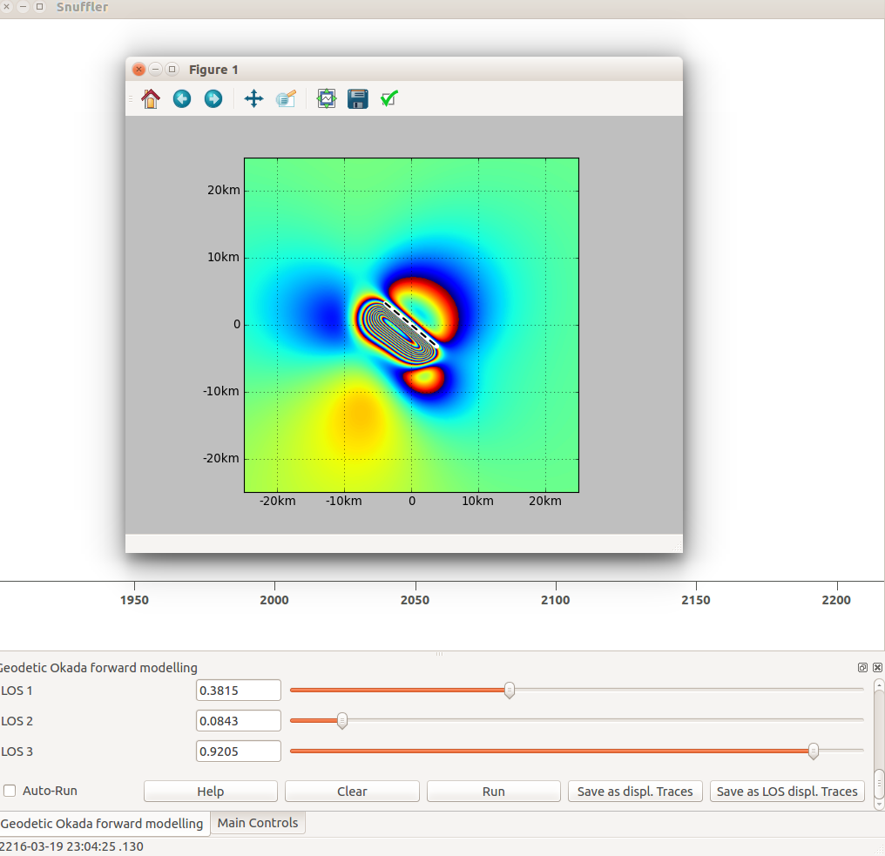
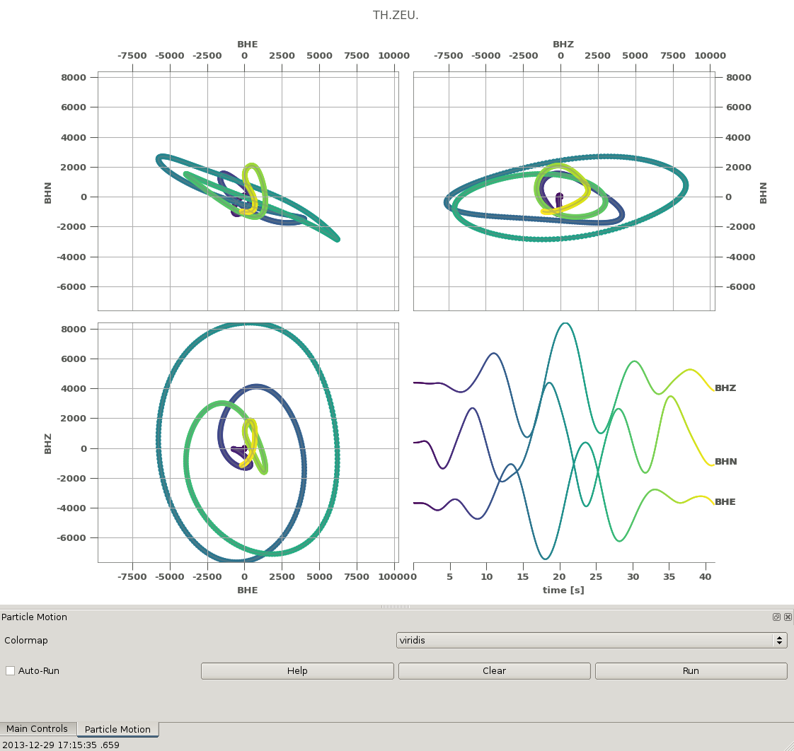

contrib-snufflings
==================

This is a repository of user contributed snufflings.

Snufflings are plugins for the
[Snuffler](http://emolch.github.io/pyrocko/v0.3/snuffler.html) trace viewer
which is part of [Pyrocko](http://emolch.github.io/pyrocko/).

Installation
------------
Clone this repository and change directory:

    git clone https://github.com/pyrocko/contrib-snufflings.git
    cd contrib-snufflings

Create symbolic links pointing from this directory into `$HOME/.snufflings`.
The `setup.py` script included in this repository provides a shortcut for that:

    python setup.py link [arguments]

If no `arguments` are provided, all available snufflings will be linked.

You will find the new snufflings under *panels* or *run* in snuffler's menu.

Update
------
Pull updates from the repository:

    git pull origin master

Contribute
----------
After cloning this repository, add your own snufflings and send a pull request.

We recommend to add a doc string at the top of each snuffling right
beneath the snuffling's class name. This text will be shown when pressing the
*Help* button on the snuffling's panel. It should give an overview of the
functionalities. Wrapping this text in html code can be used to pretty up the
documentation.

If you miss some feature in a snuffling, discover a bug or would like to
discuss an idea for a new snuffling click on *Issues* and open up a
*New Issue*.

Troublshooting
--------------

If you find yourself with broken (dangling) symlinks e.g. after
checking out a different branch you can remove all broken symlinks directory
by adding `--undangle` to the link command.

Create Map in OpenStreetMap or Google Maps
------------------------------------------

Plot station and event locations with OpenStreetMap or Google Maps

directory: [map](map)

Plot PSD
--------

Plot power spectral densities

file: [psd.py](psd.py)

Cross correlation relocation
----------------------------

Relocate events by cross correlating waveforms

file: [cc\_relocation.py](cc_relocation.py)

Cake Phase
----------

Add markers for synthetic arrivals

file: [cake\_phase.py](cake_phase.py)

Cross correlation search
------------------------

Find repeating events

file: [corrsearch.py](corrsearch.py)

Cross correlation matrix
------------------------

Cross correlate selected events. Results, including cross-correlation factor and time lags between maxima of the cross correlation can be stored in YAML format to ease later analysis.

directory: [cc\_matrix](cc_matrix)

Export wav Files 
----------------

file: [SeiSound.py](SeiSound.py)

Seismosizer
-----------

Calculate and show synthetic seismograms. The [Kiwi Tools](http://kinherd.org/kiwitools/) package must be installed for this to work.

file: [kiwi_seismosizer.py](kiwi_seismosizer.py)

Time Line
---------

Plot time vs. magnitude

file: [time_line.py](time_line.py)

Extract Events
--------------

Save waveforms for time windows around selected events as MSEED. This is a
hybrid Snuffling which can be run from the command-line as well.

file: [extract_events.py](extract_events.py)

Export Waveforms
----------------

Export selected/visible waveforms as MSEED, ASCII, SAC or YAFF files.

file: [export_waveforms.py](export_waveforms.py)

Distance Projected Waveform Plots
---------------------------------

Applying a reduction velocity allows to 'shrink' the time domain.
Figures can be exported in various image file formats like .png or .pdf.
In order to improve the visual perception of small wiggles, positive amplitudes can be plotted in filled mode.

file: [plot_traces.py](plot_traces.py)

Spectrogram
-----------

file: [spectrogram.py](spectrogram.py)

Geodetic forward modelling
----------------------------

Visualize and output of a data trace for a rectangular dislocation source in an elastic halfspace.
You will need to go to the okada dir and type make in order to compile the C-Code.

directory: [okada](okada)

Particle Motion
----------------------------

Plot combinations of vertical and horizontal channels of selected stations.

file: [particle_motion.py](particle_motion.py)

