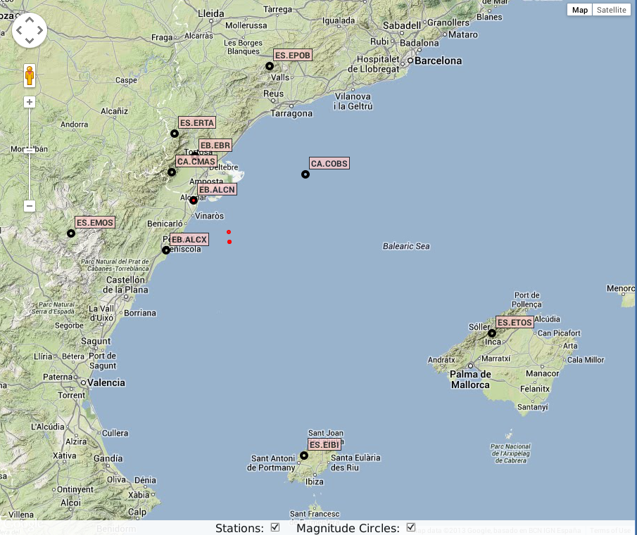
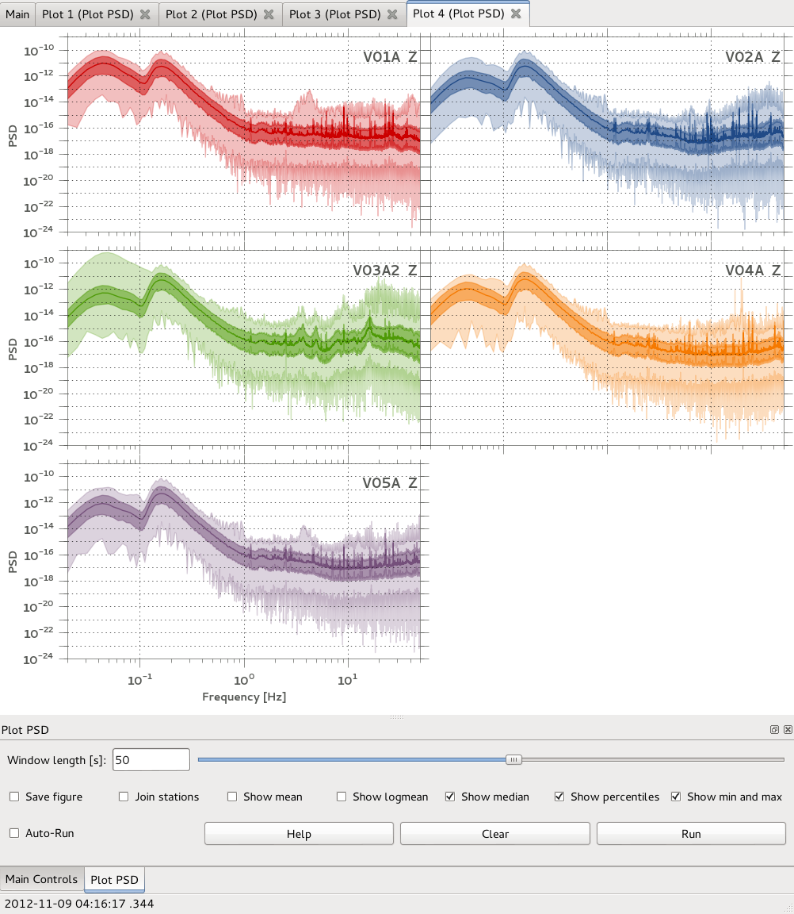
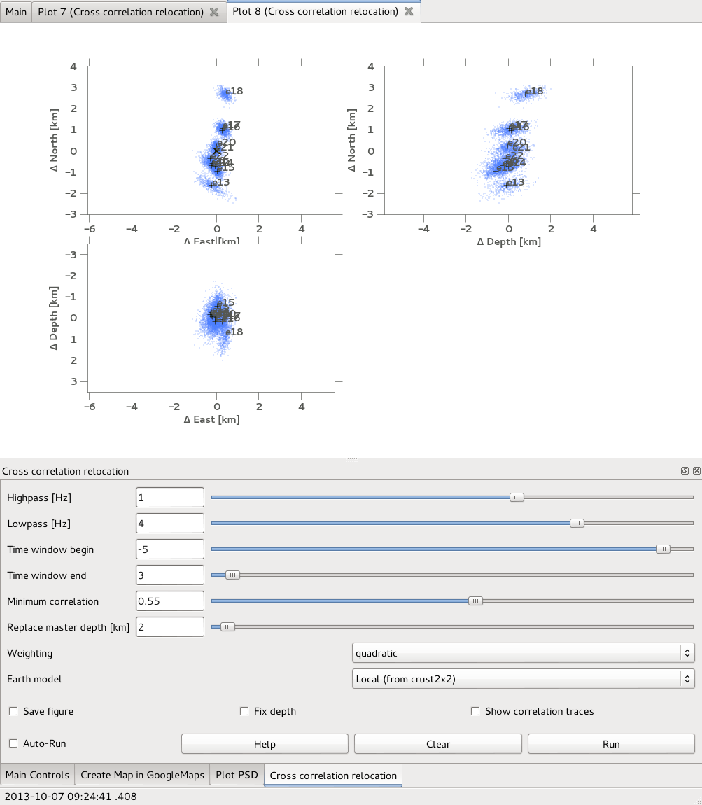
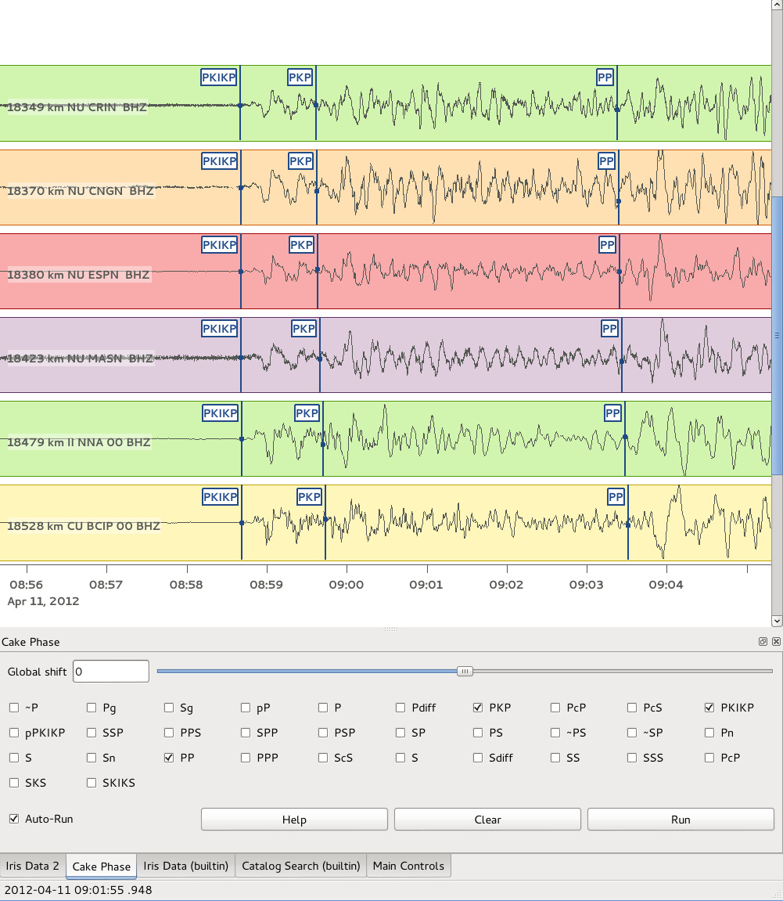
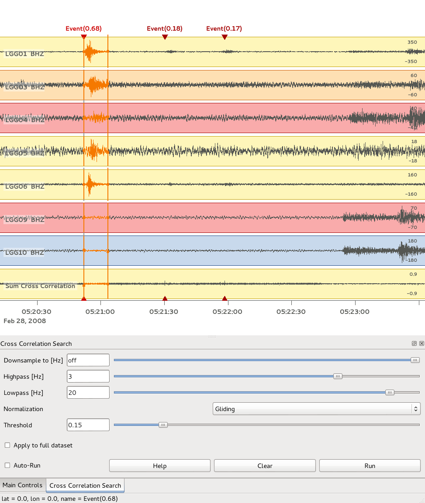
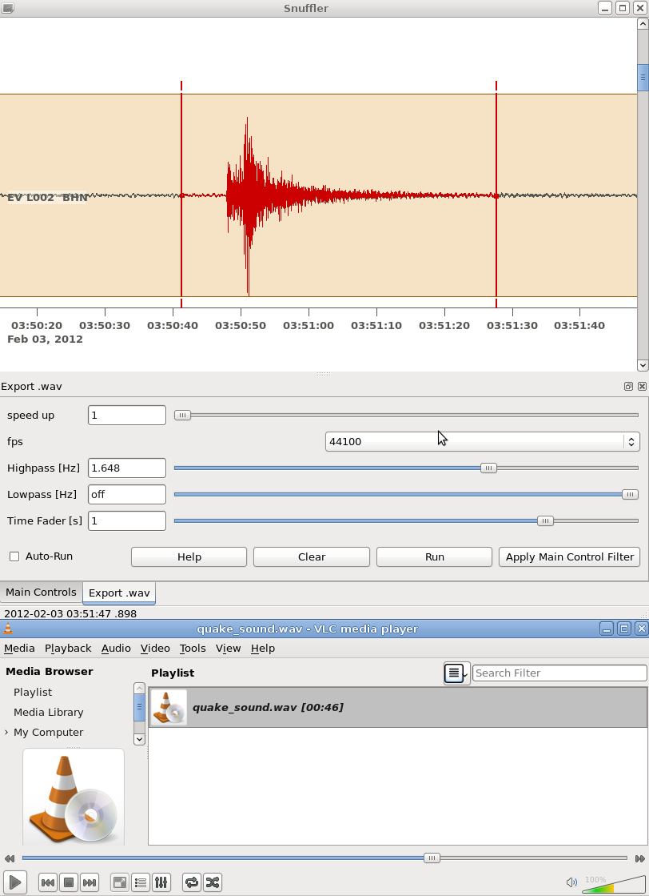

contrib-snufflings
==================

This is a repository of user contributed snufflings. 

Snufflings are plugins for the
[Snuffler](http://emolch.github.io/pyrocko/v0.3/snuffler.html) application
which is part of [Pyrocko](http://emolch.github.io/pyrocko/). 

To use any of these snufflings, simply put the respective file or directory
into the `$HOME/.snufflings` directory. 

If you want to modify, develop, or keep up to date on any of these, it is
preferable to clone the whole repos somewhere in your filesystem and just make
symbolic links in `$HOME/.snufflings` for each snuffling to be used.

To add your own creation, simply clone this repos, add your stuff and a
screenshot and send a pull request. 

Create Map in GoogleMaps
------------------------

Plot station and event locations in Google Maps

directory: [googleMapsSnuffling](googleMapsSnuffling)

Plot PSD
--------

Plot power spectral densities

file: [psd.py](psd.py)

Cross correlation relocation
----------------------------

Relocate events by cross correlating waveforms

file: [cc\_relocation.py](cc_relocation.py)

Cake Phase
----------

Add markers for synthetic arrivals

file: [cake\_phase.py](cake_phase.py)

Cross correlation search
------------------------

Find repeating events

file: [corrsearch.py](corrsearch.py)

Export wav Files 
----------------

file: [SeiSound.py](SeiSound.py)

Seismosizer
-----------

Calculate and show synthetic seismograms. The [Kiwi Tools](http://kinherd.org/kiwitools/) package must be installed for this to work.

file: [seismosizer.py](seismosizer.py)

