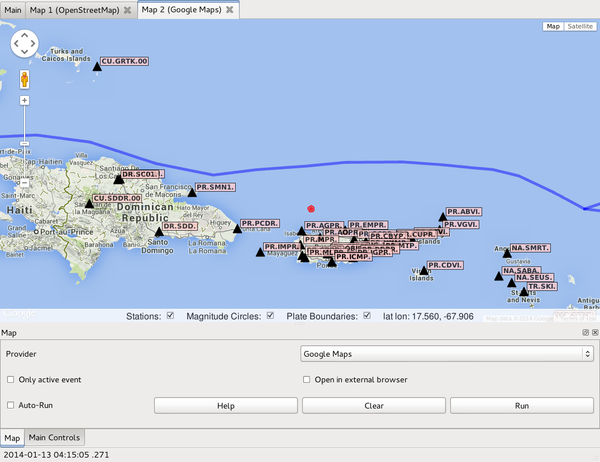
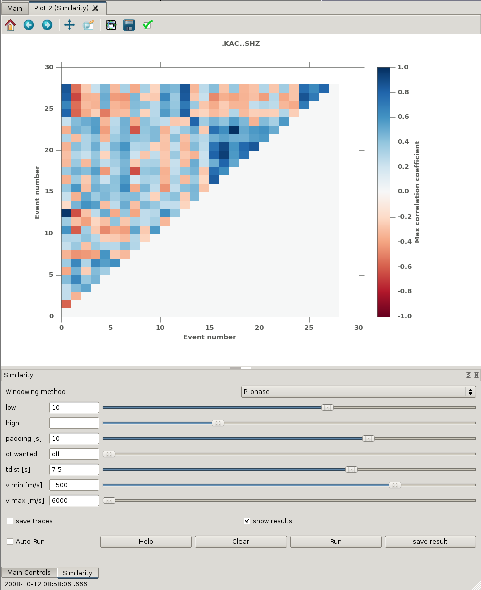
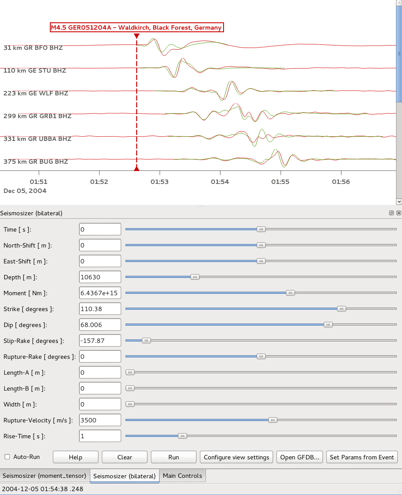
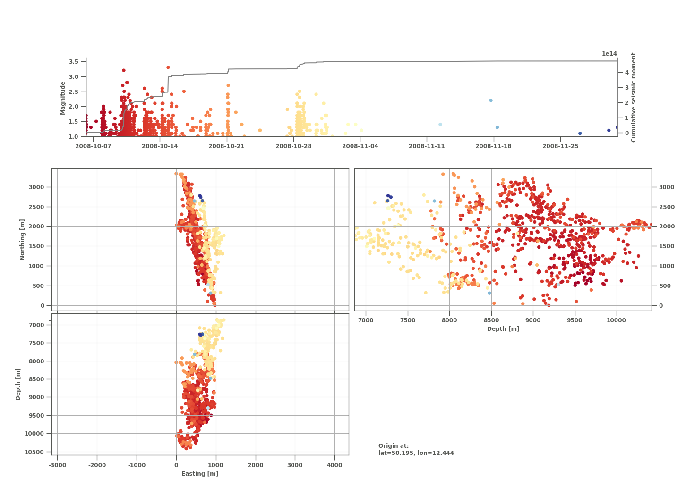
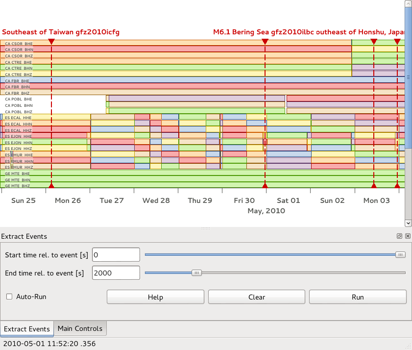

contrib-snufflings
==================

This is a repository of user contributed snufflings. 

Snufflings are plugins for the
[Snuffler](http://emolch.github.io/pyrocko/v0.3/snuffler.html) application
which is part of [Pyrocko](http://emolch.github.io/pyrocko/). 

To use any of these snufflings, simply put the respective file or directory
into the `$HOME/.snufflings` directory. 

If you want to modify, develop, or keep up to date on any of these, it is
preferable to clone the whole repos somewhere in your filesystem and just make
symbolic links in `$HOME/.snufflings` for each snuffling to be used.

The `setup.py` script included in this repository provides a shortcut to
create required symbolic links. Running `python setup.py link` will do
that for you. If you find yourself with broken (dangling) symlinks e.g. after
checking out a different branch you can remove all broken symlinks in your
`$HOME/.snufflings` directory by adding `--undangle` to the link command.

To add your own creation, simply clone this repos, add your stuff and a
screenshot and send a pull request. 

It is recommended to add some documentation at the top of each snuffling right
beneath the snuffling's class name. This text will be shown when pressing the
'Help' on the snuffling's panel and should give a rough overview of the
functionalities. Wrapping this text in html code can be used to pretty up the
documentation.

Do you have a great idea for a new snuffling? Do you miss some feature in one
snuffling? Did you discover a bug?
Given this you can click on 'Issues' and open up a 'New Issue'. Describe the
problem and wait until the community takes on action.

Create Map in OpenStreetMap or Google Maps
------------------------------------------

Plot station and event locations with OpenStreetMap or Google Maps

directory: [map](map)

Plot PSD
--------

Plot power spectral densities

file: [psd.py](psd.py)

Cross correlation relocation
----------------------------

Relocate events by cross correlating waveforms

file: [cc\_relocation.py](cc_relocation.py)

Cake Phase
----------

Add markers for synthetic arrivals

file: [cake\_phase.py](cake_phase.py)

Cross correlation search
------------------------

Find repeating events

file: [corrsearch.py](corrsearch.py)

Cross correlation matrix
------------------------

Cross correlate selected events. Results, including cross-correlation factor and time lags between maxima of the cross correlation can be stored in YAML format to ease later analysis.

directory: [cc\_matric](cc_matrix)

Export wav Files 
----------------

file: [SeiSound.py](SeiSound.py)

Seismosizer
-----------

Calculate and show synthetic seismograms. The [Kiwi Tools](http://kinherd.org/kiwitools/) package must be installed for this to work.

file: [kiwi_seismosizer.py](kiwi_seismosizer.py)

Time Line
---------

Plot time vs. magnitude

file: [time_line.py](time_line.py)

Extract Events
--------------

Save waveforms for time windows around selected events as MSEED. This is a
hybrid Snuffling which can be run from the command-line as well.

file: [extract_events.py](extract_events.py)

Export Waveforms
--------------

Export selected/visible waveforms as MSEED, ASCII, SAC or YAFF files.

file: [export_waveforms.py](export_waveforms.py)

